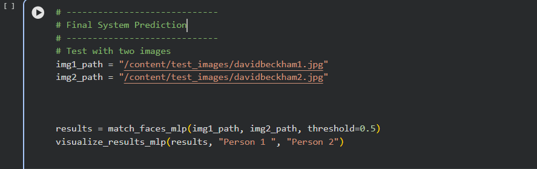

# AIFM - Age & Face Recognition Models

##  Project Reports

### Main Report:

- **[CYCV001_Report.pdf](./CYCV001_Report.pdf)** - Detailed Aage Invariant Face Matching project report

---

##  How to Run the System

Follow these steps to run the AIFM system:

1. **Open the main notebook**: Navigate to and open [`AIFM_Final_System.ipynb`](./AIFM_System_Integrated/AIFM_Final_System.ipynb)
2. **Provide test images**: In Last Cell Update the image paths in the notebook with two images you want to test
3. **Run all cells**: Execute all cells in the notebook sequentially to get matching results
### Example Code:

---

##  Project Structure

### Age Prediction Model
- **Age_Prediction_Model/** - ResNet-based age prediction models
  - [`Age_Model_Finetuning.ipynb`](./Age_Prediction_Model/Age_Model_Finetuning.ipynb) - Age model fine-tuning notebook
  - [`Age_Model_Testing.ipynb`](./Age_Prediction_Model/Age_Model_Testing.ipynb) - Model Performance Testing on test images folder 
  - `test_images/` - Test images for inference

### MLP Head
- **MLP_Head/** - Multi-Layer Perceptron fine-tuning
  - [`MLP_Dataset_Preprocessing.ipynb`](./MLP_Head/MLP_Dataset_Preprocessing.ipynb) - Data preparation for MLP
  - [`MLP_Training.ipynb`](./MLP_Head/MLP_Training.ipynb) - Training pipeline

### Preprocessing
- **Preprocessing_Pipeline/** - Reusable preprocessing modules
  - [`AIFM_Preprocessing_for_one_sample.ipynb`](./Preprocessing_Pipeline/AIFM_Preprocessing_for_one_sample.ipynb) - System preprocessing pipeline applied on one sample

### Full Integrated System
- **AIFM_System_Integrated/** - Complete integrated AIFM system
  - [`AIFM_Final_System.ipynb`](./AIFM_System_Integrated/AIFM_Final_System.ipynb) - Final integrated system with age prediction and face matching and mlp head
  - [`AIFM_System_inaccurate_vs_accurate.ipynb`](./AIFM_System_Integrated/AIFM_System_inaccurate_vs_accurate.ipynb) - Comparison of inaccurate vs accurate pipeline and showing how better to use MLP head after face embedding model rather than cosine similarity 

